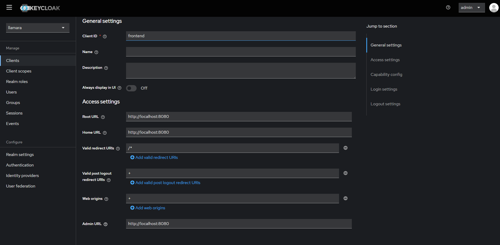
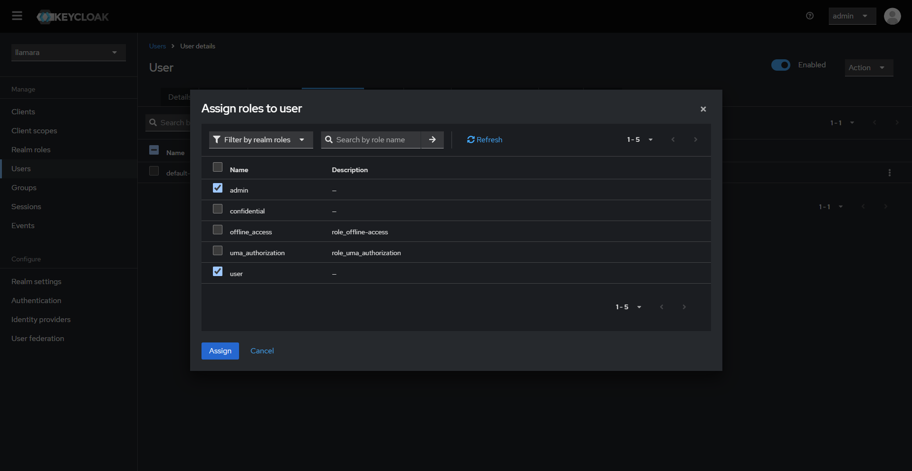

# Keycloak setup guide

## Installation
Before you start, set up the following environment variables in a `.env` file:
```dotenv
KC_POSTGRES_PASSWORD=
KC_ADMIN_PASSWORD=
```

To start needed keycloak services, run the following command:
```shell script
docker compose up
```
The Keycloak server will be available at `http://localhost:8081`.

## Keycloak Configuration

### Create a new realm:
Login to the Keycloak admin console at `http://localhost:8081/admin/master/console/` using the admin credentials you set in the `.env` file.  
Click on the "Add realm" button in the top left corner of the Keycloak admin console. Upload the provided [llamara-realm.json](./llamara-realm.json) file.  

### Adjust URLs:
1. In the Keycloak admin console, navigate to the "Clients" section.
2. Select the `frontend` client.
3. In the "Settings" tab, adjust the Root URL, Home URL, Admin URL, if needed. 


### Update backend configuration:
Update the application.yaml file with the Keycloak realm information. Adjust the `auth-server-url` to point to your Keycloak server. 
```yaml
frontend:
  oidc:
    client-id: frontend

quarkus:
  oidc:
    auth-server-url: https://URL-TO-Keycloak/realms/llamara
    client-id: backend
```
The Keycloak server has to be reachable from the backend container and the client computer. So localhost won't work.

### Setup users:
1. In the Keycloak admin console, navigate to the "Users" section.
2. Click on the "Add user" button.
3. Fill in the username. We also recommended to set first and last name to be displayed in the UI.
4. Click on the "Create" button.
5. In the "Credentials" tab, set a password for the user. Make sure to toggle the "Temporary" switch to "Off" so that the user doesn't have to reset their password on first login.
6. In the "Role Mappings" tab, and click on "Assign Roles". Select in the dropdown field "Filter by realm roles". Each user must have assigned the role `user` to be able to log in. If user should have admin rights, assign the role `admin` as well. 

